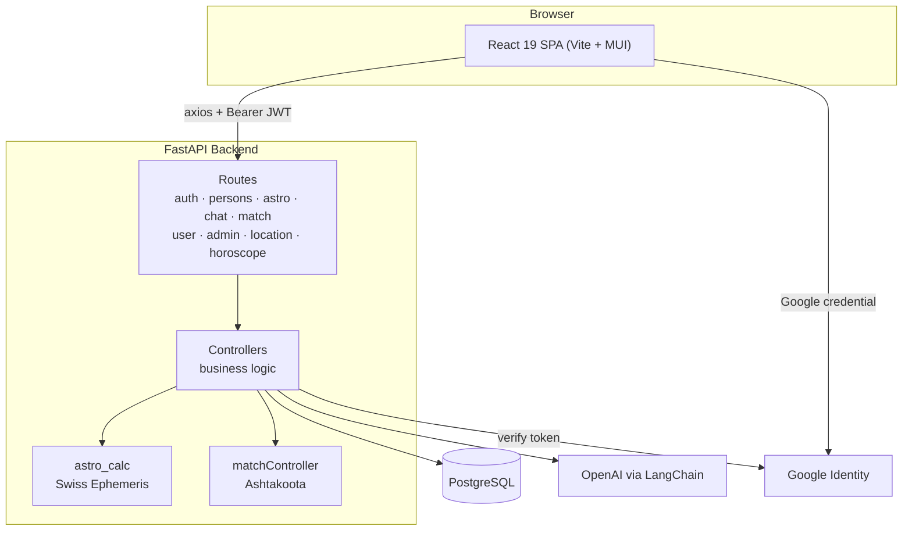
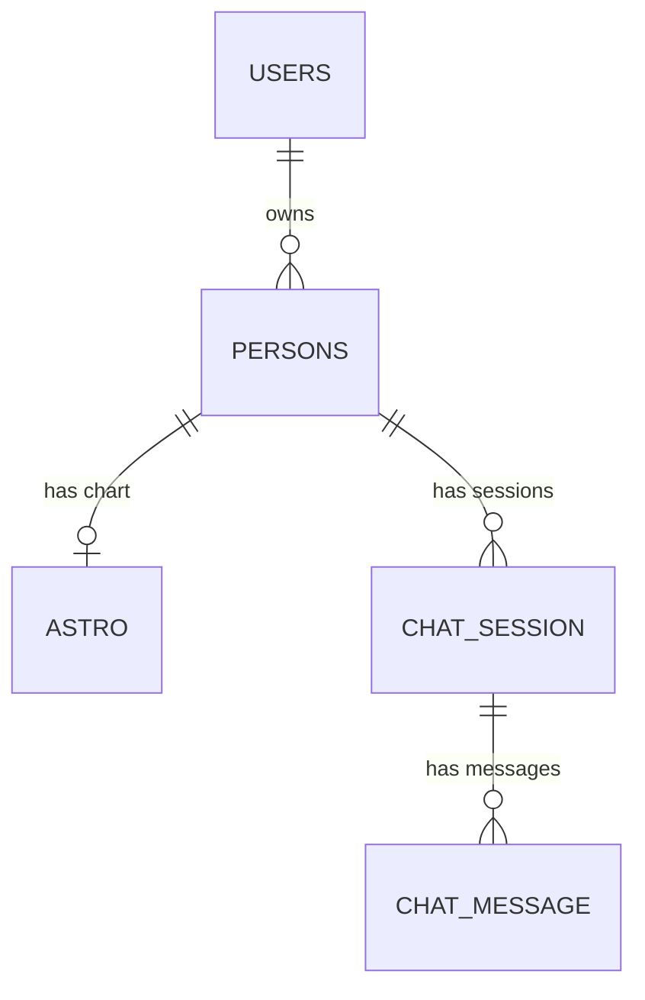

# Vedic Astro — AI-Assisted Vedic Astrology Platform

A full-stack web app that computes sidereal (Vedic) birth charts from real ephemeris data, layers an LLM interpretation on top, and exposes it through a dashboard, a per-person chat assistant, and a Kundali matching engine.

**Stack:** FastAPI · PostgreSQL · SQLAlchemy · Alembic · Swiss Ephemeris · LangChain/OpenAI · React 19 · Vite · Material UI · Docker

🔗 **Live:** [vedic-astro-ai.vercel.app](https://vedic-astro-ai.vercel.app)

---

## Features

- **Google Sign-In** — OAuth verified server-side, exchanged for the app's own JWT
- **Person profiles** — store multiple people (self, family, friends) with birth date, time and place
- **City autocomplete** — birthplace lookup resolves to latitude/longitude automatically
- **Vedic chart** — Ascendant, 12 whole-sign houses, 7 planets plus Rahu/Ketu, with signs, nakshatras and padas
- **AI analysis** — structured reading of the chart (personality, career, relationships, strengths, challenges, yogas, doshas), generated once and cached
- **Chat assistant** — conversation grounded in that person's chart, with persisted sessions and history
- **Kundali matching** — 36-point Ashtakoota (Guna Milan) scoring plus Mangal Dosha detection
- **Horoscope widget** — daily and weekly readings by sign
- **Admin panel** — email-gated user list with activity tracking

---

## Architecture



The backend follows a **route → controller → model** separation. Routes own the HTTP surface only (paths, status codes, response schemas, dependency wiring); controllers own business logic and database access; SQLAlchemy models and Pydantic schemas keep persistence and serialization concerns apart. Database sessions are provided per request through a `get_db` dependency.

On the frontend, a single axios instance owns the base URL and both interceptors — one attaching the JWT, one catching `401` and forcing a clean logout. All URLs live in one endpoint map, and every call goes through a service module, so an API change touches one file. `AuthContext` is the only global state.

---

## Tech Stack

**Backend** — FastAPI · Uvicorn · SQLAlchemy 2.0 · Alembic · PostgreSQL 16 · Pydantic v2 · pyswisseph (Swiss Ephemeris) · langchain-openai · PyJWT + google-auth

**Frontend** — React 19 · Vite 7 · Material UI 7 · React Router 7 · axios · @react-oauth/google · react-markdown · ESLint 9

**Infrastructure** — Docker Compose (Postgres + backend + frontend) · Vercel for the SPA

---

## Project Structure

```
vedic-astro/
├── docker-compose.yml           # Orchestrates db + backend + frontend
├── .env.example
│
├── backend/
│   ├── main.py                  # App setup: CORS, router registration
│   ├── Dockerfile
│   ├── entrypoint.sh            # alembic upgrade head → uvicorn
│   ├── alembic/versions/        # Migration history
│   ├── requirements.txt
│   ├── app/
│   │   ├── config/              # settings.py, database.py (engine, session, get_db)
│   │   ├── models/              # SQLAlchemy models: User, Person, Astro, ChatSession, Chat
│   │   ├── schemas/             # Pydantic request/response contracts
│   │   ├── routes/              # One APIRouter per domain
│   │   ├── controller/          # Business logic, DB access, LLM calls
│   │   ├── utilities/
│   │   │   ├── astro_calc.py    # Swiss Ephemeris chart engine
│   │   │   └── prompts.py       # LLM system prompt + analysis template
│   │   └── data/locations.json  # City dataset for autocomplete
│   └── tests/                   # API tests with dependency overrides
│
└── frontend/
    ├── Dockerfile
    ├── vite.config.js
    ├── vercel.json              # SPA rewrites + COOP header for Google popup
    └── src/
        ├── App.jsx              # Providers, routes, guards
        ├── config/              # api.js (axios + interceptors), constants.js (endpoints)
        ├── context/             # AuthContext
        ├── hooks/               # useAuth
        ├── components/          # Navbars, ProtectedRoute, PersonTable, VedicChart
        ├── pages/               # Landing, Login, Dashboard, Persons, Detail, Chat, Match, Admin
        ├── services/            # One module per backend domain
        └── utils/
```

---

## Core Modules

**`astro_calc.py`** — the chart engine. Converts birth time to UTC, derives the Julian Day, applies the Lahiri ayanamsa for sidereal positions, computes the Ascendant via house calculation, lays out whole-sign houses, and resolves each planet's sign, nakshatra and pada. Built directly on Swiss Ephemeris rather than a third-party horoscope API.

**`matchController.py`** — a from-scratch Ashtakoota (Guna Milan) implementation scoring all eight kutas out of 36 (Varna 1, Vasya 2, Tara 3, Yoni 4, Maitri 5, Gana 6, Bhakoot 7, Nadi 8), derived from each person's Moon rashi and nakshatra, plus Mangal Dosha detection.

**`astroController.py`** — computes the chart, sends it to the LLM under a fixed JSON schema, and caches both in the `astro` table so the expensive call happens once per chart. Generation runs as a background task on person creation.

**`chatController.py`** — injects the stored chart, summary and analysis as system context, replays prior turns, and persists both sides of the conversation. Session titles are auto-generated from the first message.

**`authController.py`** — verifies the Google credential (accepting both ID tokens and OAuth2 access tokens), upserts the user, and issues an HS256 JWT. Authorization is enforced in the query: person and chart lookups filter on `user_id`, so a foreign id returns `404`.

---

## Data Model



| Table | Purpose |
| --- | --- |
| `users` | Google identity, profile, `last_active_at` |
| `persons` | Name, birth datetime, place, coordinates, owning `user_id` |
| `astro` | Computed chart and AI analysis as JSON, plus ascendant sign and summary |
| `chat_session` | One conversation thread per person |
| `chat_message` | Individual turns, tagged user or assistant |

The chart and AI analysis are stored as JSON columns — the structure is deeply nested and evolving, so normalizing it would cost every read a set of joins. Stable facets like `ascendent_sign` are promoted to their own columns.

---

## API

Interactive docs at `/docs` and `/redoc` when `ENV=development`. All routes except `/location` and `/horoscope` require an `Authorization: Bearer <jwt>` header and scope their queries to the caller.

| Group | Endpoints |
| --- | --- |
| **Auth** | `POST /auth/login` · `GET /auth/verify` |
| **Persons** | `POST /persons` · `GET /persons` · `GET|PUT|DELETE /persons/{id}` |
| **Astrology** | `GET /astro/vedic-chart/{person_id}` · `GET /astro/person/{person_id}` |
| **Chat** | `POST /chat/session` · `GET /chat/person/{id}/sessions` · `POST /chat/message` · `GET /chat/session/{id}/history` · `PUT|DELETE /chat/session/{id}` |
| **Match** | `POST /match/kundali` |
| **Utility** | `GET /location/cities` · `GET /horoscope/western` · `GET /horoscope/vedic` |
| **Account** | `PUT /user/profile` · `GET /admin/users` |

---

## Getting Started

### Prerequisites

Docker and Docker Compose — or Python 3.11+, Node 20+ and PostgreSQL 16. You'll also need a Google OAuth client ID and an OpenAI API key.

### Docker (recommended)

```bash
cp .env.example .env
cp frontend/.env.example frontend/.env
# create backend/.env with SECRET_KEY, GOOGLE_CLIENT_ID, OPENAI_API_KEY, ENV=development

docker compose up --build
```

| Service | URL |
| --- | --- |
| Frontend | http://localhost:5173 |
| API | http://localhost:8000 |
| API docs | http://localhost:8000/docs |

Both services hot-reload from bind mounts, and the backend runs migrations before starting.

### Without Docker

```bash
# Backend
cd backend
python -m venv venv && source venv/bin/activate   # Windows: venv\Scripts\activate
pip install -r requirements.txt
alembic upgrade head
uvicorn main:app --reload

# Frontend
cd frontend
npm install
npm run dev
```

> `pyswisseph` compiles from source and needs a C/C++ toolchain.

---

## Configuration

**Root `.env`** (Docker Compose) — `POSTGRES_DB` · `POSTGRES_USER` · `POSTGRES_PASSWORD` · `POSTGRES_PORT` · `POSTGRES_SERVER` · `VITE_API_URL`

**`backend/.env`** — `DATABASE_URL` · `SECRET_KEY` (JWT signing) · `GOOGLE_CLIENT_ID` · `GOOGLE_CLIENT_SECRET` · `OPENAI_API_KEY` · `OPENAPI_MODEL` · `ADMIN_EMAIL` · `ENV`

**`frontend/.env`** — `VITE_API_URL` · `VITE_GOOGLE_CLIENT_ID`

Allowed CORS origins are declared in `backend/main.py` — add your deployed frontend origin before going live.

---

## Testing

```bash
cd backend
pip install -r requirements-test.txt
pytest tests
```

Tests run at the API layer with `TestClient`, using FastAPI's `dependency_overrides` to swap the database session and current user for fixtures. `conftest.py` pins SQLite and stubs the LangChain modules, so no PostgreSQL instance, network call or API key is needed.

---

## Deployment

**Frontend → Vercel.** `vercel.json` handles SPA rewrites and sets `Cross-Origin-Opener-Policy: same-origin-allow-popups`, required by the Google sign-in popup. Set `VITE_API_URL` and `VITE_GOOGLE_CLIENT_ID` as environment variables.

**Backend → any container host.** Needs a managed PostgreSQL instance via `DATABASE_URL`, `ENV` set to something other than `development` so the docs stay closed, and the frontend origin added to the CORS list.

---

## Roadmap

- Declared foreign keys with `ON DELETE CASCADE`
- Per-person timezone storage to replace the longitude-based UTC offset fallback
- Rate limiting on the public utility routes
- Streaming chat responses via server-sent events
- Frontend component tests

---

## License

No license file is currently present. Add one before reuse or distribution.
